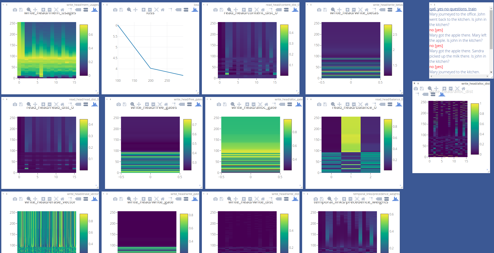

PyTorch implementation of custom DNC variants
=============================================

Please see our ICLR 2019 paper on https://openreview.net/forum?id=HyGEM3C9KQ for more details.

Tasks
-----
Supported tasks:
* bAbI
* copy
* repeated copy
* associative recall
* key-value recall
* 2 way key-value recall

Visualization and debugging
---------------------------

Many interesting internal states of the DNC are visualized inside Visdom. Check console output for the port.



Usage
-----

Everything is done by main.py. Use -name to give some path (it will be created if doesn't exists), where the state of the training will be saved. Check out main.py for more information about the flags available.

Most of the trainings can be run by profiles:

```bash
./main.py -name <train dir> -profile babi
```

Supported profiles: babi, repeat_copy, repeat_copy_simple, keyvalue, keyvalue2way, associative_recall.

If you want to train a pure DNC, use add "dnc" to the profile:

```bash
./main.py -name <train dir> -profile babi,dnc
```

For other options, see main.py.

DNC variants
------------

The variant of DNC can be specified as a profile. Supported variants:
dnc, dnc-msd, dnc-m, dnc-s, dnc-d, dnc-md, dnc-ms, dnc-sd.

Reusing the code
----------------

The DNC is implemented as a single file (Models/DNC.py) depending only on torch. You should be able to reuse it very easily. Please check main.py for details on its interface.

Dependencies
------------

PyTroch (1.0), Python 3. Others can be installed by running pip3 -r requirements.txt.

License
-------

The software is under Apache 2.0 license. See http://www.apache.org/licenses/LICENSE-2.0 for further details.
